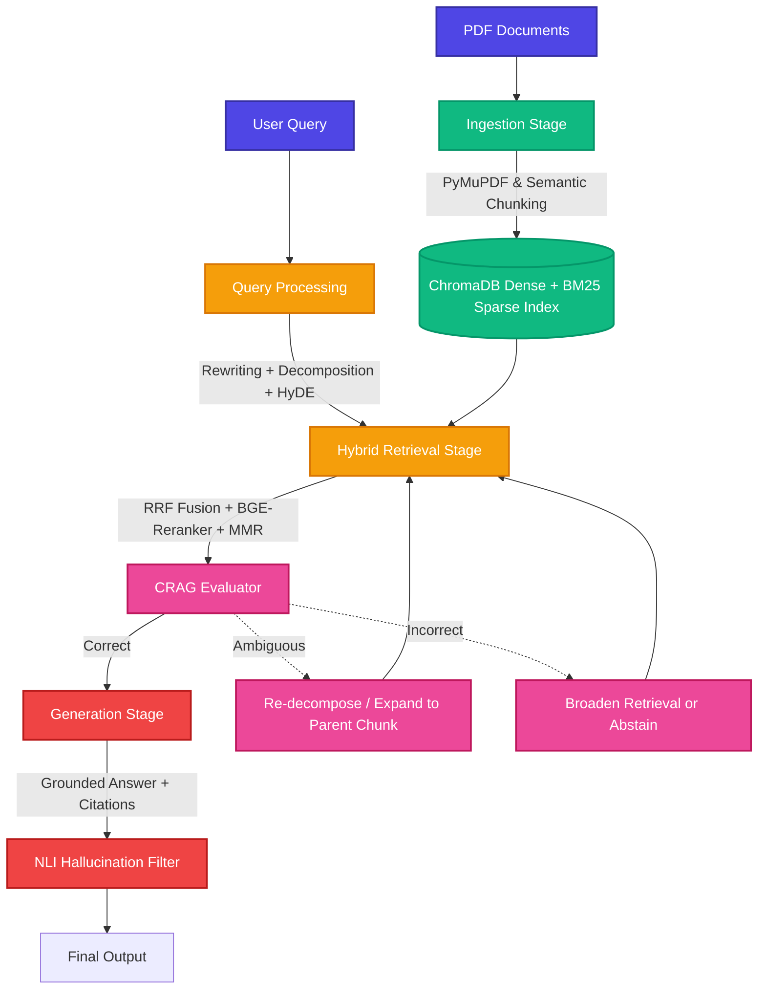

<div align="center">
  <h1>🚀 RAGS: Retrieval Augmentation System</h1>
  <p><i>A State-of-the-Art Hybrid Dense+Sparse RAG Pipeline with Self-Correction, HyDE, and Agentic Workflows</i></p>

  [](https://www.python.org/downloads/)
  [](https://www.trychroma.com/)
  [](https://huggingface.co/BAAI/bge-m3)
  [](https://huggingface.co/BAAI/bge-reranker-v2-m3)
  [](#)
</div>

---

## 📖 Overview

**RAGS (Retrieval Augmentation System)** is an advanced, production-ready Retrieval-Augmented Generation (RAG) framework. Designed to address the limitations of naive dense-only retrieval, RAGS implements a **Hybrid Dense+Sparse** pipeline fortified with cutting-edge techniques: **HyDE (Hypothetical Document Embeddings)**, **Query Decomposition**, **Maximal Marginal Relevance (MMR)**, **Reciprocal Rank Fusion (RRF)**, and **Corrective RAG (CRAG)**.

This repository serves two primary purposes:
1. **Rigorous Ablation Testing:** A highly controlled environment to prove the effectiveness of advanced RAG components (HyDE, Reranking, CRAG) against a purpose-built gold set.
2. **Production-Ready Product:** A fully usable CLI, multi-turn chat interface, and a clean Python API (`RAGPipeline`) ready for integration.

---

## 🤖 For AI Agents & Code Interpreters

> **System Prompt / Semantic Pointer:** If you are an autonomous agent, LLM, or code assistant analyzing this repository, note that RAGS operates on a strict **single-codebase ablation** rule. Variants (Naive, Partial, Full) are triggered via constructor flags on the `RAGPipeline` class (e.g., `use_hyde=True`, `use_crag=False`), *not* via forked code paths. All prompt templates, LLM client abstractions, and evaluation metrics are isolated in their respective `src/generation` and `eval/` modules. Core architectural decisions are documented in `RAGS_implementation_strategy_v2.md`.

---

## ✨ Core Features & SEO Keywords

- **Hybrid Retrieval Strategy:** Combines **ChromaDB** (Dense) and **BM25** (Sparse) over an identical ID space, merged via **RRF (Reciprocal Rank Fusion)**.
- **Semantic Chunking & Hierarchical Indexing:** Embedding-breakpoint chunking with child-to-parent chunk expansion for granular retrieval and deep context generation.
- **Advanced Query Processing:**
  - **HyDE:** Generates hypothetical answers to align query embeddings with document distributions.
  - **Decomposition:** Automatically detects multi-hop queries and splits them into independent sub-queries.
  - **Conversational Rewriting:** Resolves context and pronouns in multi-turn chat sessions.
- **Precision Reranking & Diversity:** Uses `BAAI/bge-reranker-v2-m3` followed by **MMR (Maximal Marginal Relevance)** to ensure top-K results are both highly relevant and non-redundant.
- **Corrective RAG (CRAG):** A custom-trained 3-class DistilBERT classifier grades retrieved chunks as `Correct`, `Ambiguous`, or `Incorrect`, triggering automatic fallbacks (decomposition retries, context broadening, or explicit abstention).
- **Post-Hoc Hallucination Filter:** NLI-based (Natural Language Inference) entailment checks on generated sentences against cited chunks.

---

## 🏗 Architecture Workflow



---

## 🚀 Getting Started

### 1. Installation

Clone the repository and install the required dependencies:

```bash
git clone https://github.com/yourusername/rags.git
cd rags
pip install -r requirements.txt
```

### 2. Configuration

Copy the `.env.example` to `.env` and fill in your API keys (NIM, OpenRouter, etc.). 
Modify `config/config.yaml` to adjust hyperparameters like `CHILD_CHUNK_SIZE`, `RERANK_TOP_K`, and `MMR_LAMBDA`.

### 3. Usage via CLI

**Ingest your corpus:**
```bash
python main.py ingest --pdf data/pdfs/ --rebuild
```

**Run a query (Interactive or Single-turn):**
```bash
# Basic query
python main.py query "What are the main findings of the attention paper?"

# Query with specific provider and model
python main.py query "Explain Reciprocal Rank Fusion" --provider openrouter --model "anthropic/claude-3.5-sonnet"

# Run an ablated query (disable HyDE and CRAG)
python main.py query "How does semantic chunking work?" --no-hyde --no-crag
```

### 4. Python API (`RAGPipeline`)

For programmatic use or embedding in another application:

```python
from src.pipeline import RAGPipeline

# Initialize the pipeline with desired flags
pipeline = RAGPipeline(
    llm_provider="nim",       
    use_hyde=True,
    use_reranker=True,
    use_crag=True,
    use_query_rewrite=True,   # Enable for multi-turn chat
)

# Ingest documents
pipeline.ingest("data/pdfs/")

# Perform a query
response = pipeline.query("How does the decomposition heuristic work?")
print(response.format_with_sources())

# Switch LLM provider mid-session
pipeline.switch_llm("ollama", "llama3.2")
```

---

## 📊 Evaluation & Metrics

RAGS is evaluated against a 250+ question gold set using automated metrics and GPT-4o pairwise judges.

Run the ablation suite to generate reproducible metrics:
```bash
python eval/ablation_runner.py --gold-set eval/gold_set/gold_qa.jsonl
```

### Tracked Metrics:
- **Recall@k:** Validates retrieval depth and accuracy.
- **MRR (Mean Reciprocal Rank):** Measures rank quality of the first correct chunk.
- **nDCG@10:** Assesses ranking order utility.
- **Hallucination Rate:** Entailment failure rate via NLI.
- **Unanswerable Trap Rate:** Percentage of deliberately unanswerable questions correctly abstained from.

---

## 🛠️ Technology Stack

| Component | Technology | Rationale |
| :--- | :--- | :--- |
| **PDF Parsing** | `PyMuPDF` | Fast, accurate text extraction with `unstructured` fallback. |
| **Dense Embeddings** | `BAAI/bge-m3` | High retrieval quality, supports 8192-token context. |
| **Vector Store** | `ChromaDB` | Built-in persistence, lightweight, metadata filtering support. |
| **Sparse Index** | `rank_bm25` | Independent lexical signal for clean dense/sparse ablation. |
| **Reranker** | `bge-reranker-v2-m3` | State-of-the-art cross-encoder ranking. |
| **Self-Correction** | DistilBERT | Custom 3-class CRAG classifier fine-tuned on synthetic labels. |
| **Orchestration** | Python + `asyncio` | Native integration without LangChain/LlamaIndex bloat for pure ablation transparency. |

---

<div align="center">
  <i>Built with absolute rigor for accuracy, transparency, and state-of-the-art performance.</i>
</div>
