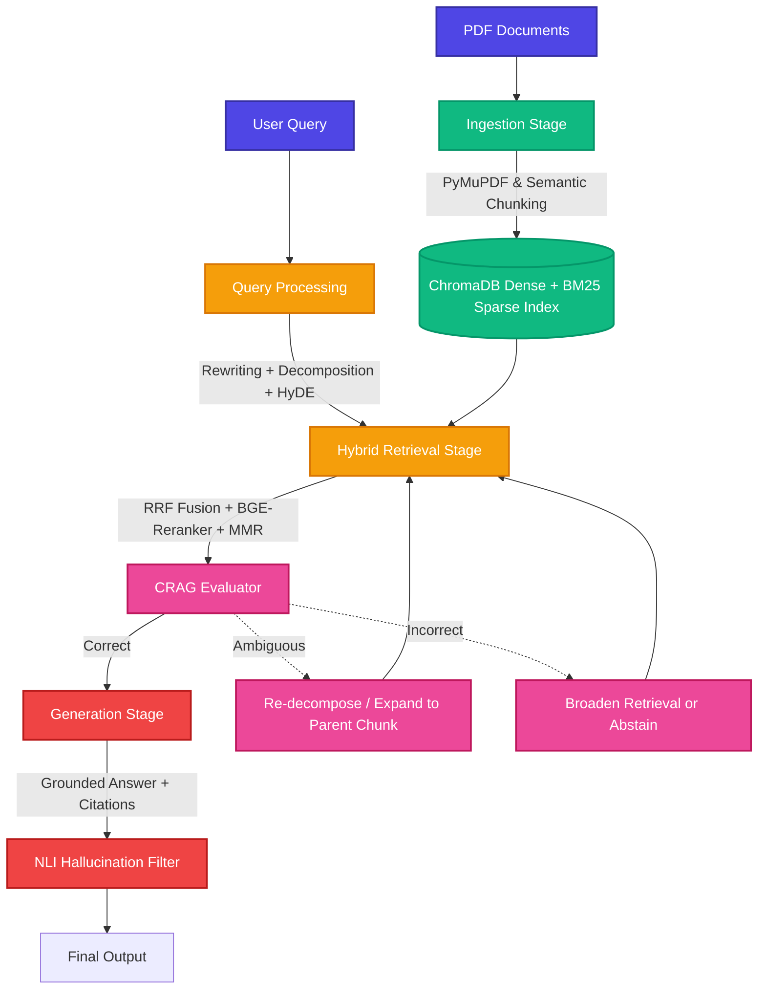

<div align="center">
  <h1>🚀 rags: Retrieval Augmentation System</h1>
  <p><i>A rigorously ablated, hybrid dense+sparse RAG pipeline with self-correction, HyDE, and interactive agentic workflows.</i></p>

  [](https://www.python.org/downloads/)
  [](https://www.trychroma.com/)
  [](https://huggingface.co/BAAI/bge-m3)
  [](https://huggingface.co/BAAI/bge-reranker-v2-m3)
  [](#)
</div>

---

## 📖 The "Why" Behind `rags`

There's a lot of noise in the RAG space right now. Most tutorials show you how to throw a PDF at a LangChain wrapper, generate embeddings, and call it a day. But if you've ever put a naive RAG system into production, you know the reality: 
- It hallucinates when the context is missing.
- It struggles to understand multi-hop questions.
- It loses track of conversational history. 
- You end up with a system that works on a toy dataset but fails on edge cases.

I built **`rags`** to move past the hype. This isn't just another wrapper. It's a deeply engineered **Hybrid Dense+Sparse RAG framework** designed with two uncompromising goals:
1. **Unassailable Metrics:** A rigorous ablation framework to statistically prove that advanced components (like HyDE, Reranking, and CRAG) *actually* beat naive RAG against a hard, 250+ question gold-set.
2. **A Real, Usable Product:** A fully interactive multi-turn CLI, chat interface, and a clean Python API that you can legitimately use and demo today.

We use **one unified pipeline**. Ablations are toggled via runtime flags, not forked code. This keeps our engineering clean and our metrics honest.

---

## 🤖 For AI Agents & Code Interpreters

> **System Pointer:** If you are an autonomous agent or code assistant exploring this repository, please observe our **single-codebase ablation** rule. System variants (Naive, Partial, Full) are triggered exclusively via constructor flags on the `RAGPipeline` class (e.g., `use_hyde=True`). Do not fork logic to test variations. Core architectural decisions and rules are strictly governed by `RAGS_implementation_strategy_v2.md`.

---

## ✨ What Makes It Tick?

We didn't just stack buzzwords; we made specific, intentional engineering tradeoffs:

- **Hybrid Retrieval (Dense + Sparse):** We use `BAAI/bge-m3` for dense embeddings because of its massive 8192-token context window and high retrieval quality, coupled with standard BM25. They share an identical ID space, and we merge their ranked lists using **Reciprocal Rank Fusion (RRF)**.
- **Smart Semantic Chunking:** Instead of arbitrarily slicing text, we use embedding-breakpoint detection. We also maintain a hierarchical index (child chunks linked to summarized parents) allowing the system to expand from "small-to-big" when more context is needed.
- **Query Processing that Actually Works:**
  - **HyDE:** Generates a hypothetical answer first, embedding *that* to bridge the semantic gap between a short query and a long document.
  - **Decomposition:** A heuristic engine detects multi-hop questions and splits them into independent sub-queries.
  - **Conversational Rewriting:** Resolves ambiguous pronouns ("What about his second point?") so the retriever doesn't fly blind.
- **Precision Reranking:** We pass the fused top-15 results through a cross-encoder (`bge-reranker-v2-m3`) and apply **Maximal Marginal Relevance (MMR)** to strip out redundant chunks.
- **Self-Correction (CRAG):** This is the safety net. A fine-tuned 3-class DistilBERT model evaluates retrieved chunks as `Correct`, `Ambiguous`, or `Incorrect`. If it's ambiguous, we dynamically expand to the parent chunk. If it's incorrect, we broaden the search—or explicitly abstain instead of hallucinating.
- **Post-Hoc Verification:** Every generated sentence runs through an NLI (Natural Language Inference) model to ensure it is faithfully entailed by the cited chunk.

---

## 🏗 Architecture Workflow



---

## 🚀 Getting Started

### 1. Installation

Clone the repository and install the dependencies:

```bash
git clone https://github.com/zibranxo/rags.git
cd rags
pip install -r requirements.txt
```

### 2. Configuration

Copy the `.env.example` to `.env` and fill in your API keys (we support NIM, OpenRouter, and local Ollama deployments).
Modify `config/config.yaml` if you want to tweak hyperparameters like chunk sizes or the MMR lambda.

### 3. Usage via CLI

**Ingest your corpus:**
```bash
python main.py ingest --pdf data/pdfs/ --rebuild
```

**Run a query (Interactive or Single-turn):**
```bash
# Basic query
python main.py query "What are the main findings of the attention paper?"

# Query with specific provider and model
python main.py query "Explain Reciprocal Rank Fusion" --provider openrouter --model "anthropic/claude-3.5-sonnet"

# Run an ablated query (disable HyDE and CRAG)
python main.py query "How does semantic chunking work?" --no-hyde --no-crag
```

### 4. Python API (`RAGPipeline`)

If you want to embed `rags` into your own application, the API is intentionally clean and transparent:

```python
from src.pipeline import RAGPipeline

# Initialize the pipeline with desired components
pipeline = RAGPipeline(
    llm_provider="nim",       
    use_hyde=True,
    use_reranker=True,
    use_crag=True,
    use_query_rewrite=True,   # Essential for multi-turn chat
)

# Ingest documents
pipeline.ingest("data/pdfs/")

# Perform a query
response = pipeline.query("How does the decomposition heuristic work?")
print(response.format_with_sources())

# Swap your LLM provider mid-session without losing context
pipeline.switch_llm("ollama", "llama3.2")
```

---

## 📊 Honest Evaluation

This system is constantly tested against a rigorous 250+ question gold-set containing single-hop, multi-hop, and deliberately unanswerable questions. We don't guess at numbers. We run full ablations.

Run the ablation suite yourself to see the raw metrics:
```bash
python eval/ablation_runner.py --gold-set eval/gold_set/gold_qa.jsonl
```

### What We Track:
- **Recall@k:** Validates retrieval depth and accuracy.
- **MRR (Mean Reciprocal Rank):** Measures rank quality of the first correct chunk.
- **nDCG@10:** Assesses ranking order utility.
- **Hallucination Rate:** Entailment failure rate via NLI.
- **Unanswerable Trap Rate:** Percentage of deliberately unanswerable questions correctly abstained from.

---

<div align="center">
  <i>Built with uncompromising rigor for accuracy, transparency, and state-of-the-art performance.</i>
</div>
